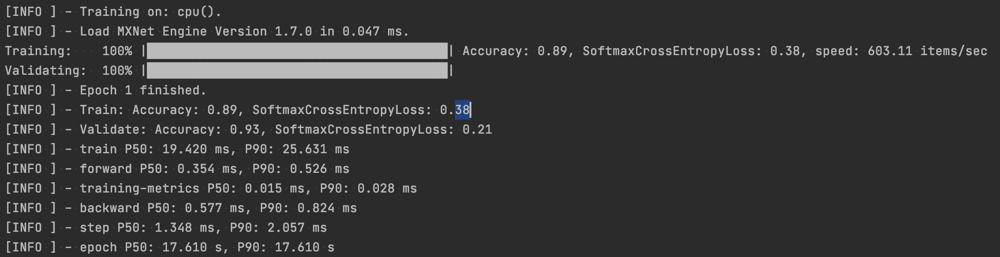

# my-first-deep-learning-model-by-java

基于[awslabs/djl](https://github.com/awslabs/djl) 完成模型的训练与使用

## 背景

程序开发过程，其实是对现实的一种抽象，并翻译成电脑可以理解的语言，让电脑运行。
但是有些事物并不是那么确定且容易描述的，比如：如何向电脑描述图片中的数字？


我们可以一眼就识别出这个数字，但是没办法反推并描述这个过程。走一步算一步吧，先把代码写起来。
从程序开发角度，我们会定义一个接口函数，明确这个函数的输入、输出。

```java
Integer recognition(Image img);
```

但是在实现函数时，感觉无从下手。这时就需要DeepLearning来帮助我们完成这个函数。可以认为模型就是这个函数的实现，而训练模型的过程就是编写(or 发现)这个函数。

## 概念

训练模型的过程是让DeepLearning去发现一个函数，我们需要描述这个函数长什么样。

### 数据集

首先，我们会定义这个模型的输入和输出。
图像大小为28x28，因为是灰度图，每个像素点只有黑白两种状态。用一个标识来描述处于某种状态，则模型的输入为一个大小为28x28的一维数组。预期的输出为数字识别，所以结果为0-9共10个数字，可以认为输出是一个大小为10的一维数组。

```java
byte[10] recognition(byte[28*28] img);
```


因为不知道如何描述这个映射关系，所以我们采用了另一种方式: 并不定义实现，而是拿一些已有数据，让模型自己总结其中的规律。

比如，输入一个数字6的图片，告诉模型这张图片最终会映射为6。也就是说我们的输入包括两部分图像本身(Data)和表示的内容6(Label)。

在模型训练的过程中需要使用大量的数据(Data+Label)，这一批数据称之为数据集(Dataset)。而数据集因为作用不同，又会被划分为

1. 训练集
2. 验证集
3. 测试集

这3个概念非常符合我们的学习过程

1. 训练集: 课堂教学。老师上课时为了描述1+1=2时，举的例子1个苹果+一个苹果，最终拿到2个苹果。
2. 验证集: 课后作业。看一下学生的掌握情况，决定下一步的教学。同时为了避免学生过分背题(这还有一个高大上的名字叫做"过拟合")，导致只知道苹果+苹果，而不知道香蕉+香蕉。
3. 测试集: 期末考试。为判断学生是否真正掌握了知识，用上课时未出现的题目进行测试。

### 神经网络

模型自己总结映射关系，可以认为是学习的概念，那深度的概念如何体现呢？经过实验发现，如果在输入、输出之间增加一些层(layer)进行映射，会得到更好的效果。增加的这些层被称为Hidden Layers，深度也就是指Hidden Layers的层数。


那么多少层会得到最好的效果呢？随缘吧。
并没有公式可以指导我们建立多少层，只能通过实验结果反证在什么样的layer可以获得好的效果。

## 代码

通过djl来帮助我们完成模型训练及使用

```xml
<dependency>
  <groupId>ai.djl</groupId>
  <artifactId>api</artifactId>
  <version>${djl.version}</version>
</dependency>
```

### Dataset

在数据制备阶段，通过图像Data的名称来描述Label，并放到相关文件目录下。


扫描文件目录进行加载，并提供Data+Label的获取方式

```java
public class MnistDataset extends RandomAccessDataset {

    @Override
    public void prepare(Progress progress) throws IOException {
        if (prepared) {
            return;
        }

        try (Stream<Path> paths = Files.walk(path)) {
            items = paths.map(p -> p.toFile().getName())
                    .filter(n -> n.endsWith(".png"))
                    .distinct()
                    .collect(Collectors.toList());
        }
        prepared = true;
    }

    @Override
    protected long availableSize() {
        return items.size();
    }

    @Override
    public Record get(NDManager manager, long index) {
        String item = items.get(Math.toIntExact(index));
        Path imagePath = Paths.get(path.toString(), item);
        NDArray imageArray = null;
        try {
            imageArray = ImageFactory.getInstance()
                    .fromFile(imagePath)
                    .toNDArray(manager, Image.Flag.GRAYSCALE);
        } catch (IOException e) {
            e.printStackTrace();
        }
        NDList data = new NDList(imageArray);
        NDList labels = new NDList(1);
        labels.add(manager.create(Integer.parseInt(item.split("_")[0])));
        return new Record(data, labels);
    }

}
```

### Train

按照输入输出，并设置2层hidden layers构成Block，将数据集以每次一张图片(Shape)的方式进行计算。

```java
public TrainingResult train(Arguments arguments) throws IOException, TranslateException {
    if (arguments == null) {
        return null;
    }
    // Construct neural network
    Block block = new Mlp(28 * 28, 10, new int[]{128, 64});

    try (Model model = Model.newInstance("first")) {
        model.setBlock(block);

        // get training and validation dataset
        RandomAccessDataset trainingSet = getDataset(Dataset.Usage.TRAIN, arguments);
        RandomAccessDataset validateSet = getDataset(Dataset.Usage.TEST, arguments);

        // setup training configuration
        DefaultTrainingConfig config = setupTrainingConfig(arguments);

        try (Trainer trainer = model.newTrainer(config)) {
            trainer.setMetrics(new Metrics());

            /*
             * MNIST is 28x28 grayscale image and pre processed into 28 * 28 NDArray.
             * 1st axis is batch axis, we can use 1 for initialization.
             */
            Shape inputShape = new Shape(1, Mnist.IMAGE_HEIGHT * Mnist.IMAGE_WIDTH);

            // initialize trainer with proper input shape
            trainer.initialize(inputShape);

            EasyTrain.fit(trainer, arguments.getEpoch(), trainingSet, validateSet);

            return trainer.getTrainingResult();
        }
    }
}

private DefaultTrainingConfig setupTrainingConfig(Arguments arguments) {
    String outputDir = arguments.getOutputDir();
    SaveModelTrainingListener listener = new SaveModelTrainingListener(outputDir);
    listener.setSaveModelCallback(
            trainer -> {
                TrainingResult result = trainer.getTrainingResult();
                Model model = trainer.getModel();
                float accuracy = result.getValidateEvaluation("Accuracy");
                model.setProperty("Accuracy", String.format("%.5f", accuracy));
                model.setProperty("Loss", String.format("%.5f", result.getValidateLoss()));
            });
    return new DefaultTrainingConfig(Loss.softmaxCrossEntropyLoss())
            .addEvaluator(new Accuracy())
            .optDevices(Device.getDevices(arguments.getMaxGpus()))
            .addTrainingListeners(TrainingListener.Defaults.logging(outputDir))
            .addTrainingListeners(listener);
}
```



在性能检测中有一个Accuracy指标，表示的意思是 正确的数量/总数量 ， 但是不能只依赖这个指标作为模型性能的判断。比如，我训练一个模型预测北京一年内某天是否会沙尘暴，如果这一年只有一天沙尘暴，而我的模型预测每一天都不会沙尘暴，那模型的Accuracy为364/365>99% 但显然这个模型是失败的。


### inference

使用模型时，需要设定同样的Block，图像经过映射后会得到一个结果，但是并不会得到唯一解，而是获取多个结果及可能性比例。可以选择获取best

```java
public static Integer recognition(Image img) throws IOException, TranslateException, MalformedModelException {
    Model model = Model.newInstance("first");
    Path modelDir = Paths.get("build/model");
    Predictor<Image, Classifications> predictor = null;
    Block block = new Mlp(28 * 28, 10, new int[]{128, 64});

    try {
        model.setBlock(block);
        model.load(modelDir);

        List<String> classes = IntStream.range(0, 10).mapToObj(String::valueOf).collect(Collectors.toList());
        Pipeline pipeline = new Pipeline();
        pipeline.add(new Resize(28, 28))
                .add(new ToTensor());

        Translator<Image, Classifications> translator =
                ImageClassificationTranslator.builder()
                        .setPipeline(pipeline)
                        .optSynset(classes)
                        .build();
        predictor = model.newPredictor(translator);
        Classifications classifications = predictor.predict(img);
        return Integer.parseInt(classifications.best().getClassName());
    } catch (MalformedModelException e) {
        log.error("model inference error! image:{}", img, e);
        throw e;
    } catch (TranslateException e) {
        log.error("translate error! image:{}", img, e);
        throw e;
    } finally {
        model.close();
        if (null != predictor) {
            predictor.close();
        }
    }
}
```


## 其他

模型学习的是知识，data和label之间要具备因果关系。比如：名字和是否能上清华之间存在关系吗？显然不，你不能训练一个模型来预测某个名字的人能否上清华。你还要加入生辰八字。。等等，我好像已经发现了一条致富之路，不说了，我要带着模型去摆摊了